# Pompous Caslon Decorations


## Inspiration

I recently went through the
[exercise](https://github.com/mkmcc/LatexFonts) of installing nice
open-type fonts for use in pdfLaTex.  When looking at the character
table for *Caslon*, I noticed these ornament symbols, some of which
seem fairly mysterious:

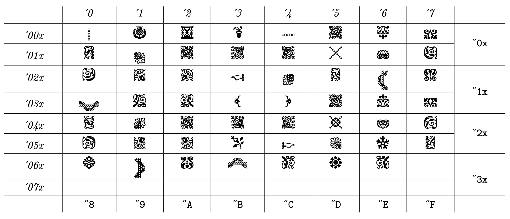

I puzzled out how they might go together and made a latex package to
make them easier to use.  This package of course requires you to have
the font, and to have used `autoinst` to install it into your LaTeX
texmf tree.  That process is quite involved, and I'm not sure I'd
recommend it.  But if you do, you can make use of these pompous
designs.

(Pompous not to anything intrinsic in the glyphs; they seem expertly
crafted, and I'm sure it's possible to make beautiful things with
them.  Perhaps this code might enable you to do so.  But in the hands
of a philistine like me, these are the designs you get.)


## Example Business Card

```latex
  \drawtilepattern{%
    tileA=\mdbia,%
    colorA=silver,%
    tileB=\mdbia,%
    colorB=silver,%
    tileC=\mdbb,%
    colorC=silver,%
    tileD=\mdbib,%
    colorD=silver,%
    Nx=9,%
    Ny=5,%
    displaywidth=3.5in,%
    displayheight=2in%
  }

  \pompousframecentered{%
    Nx=9,%
    Ny=4,%
    position={(\cardWidth/2, \cardHeight/2)},
    text={\textsw{Pompous Extr. Maximus, Ph.D.}\\
      \textsc{Piled Higher} \textsw{\&} \textsc{Deeper}\\
      \textsw{minted} 2014},
      background=white
  }

```

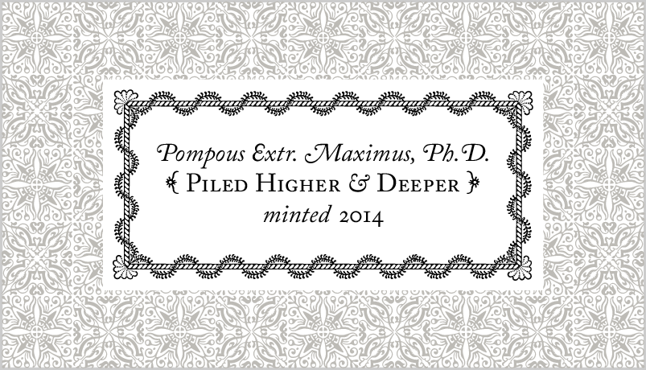

```latex
  \drawxgrid{%
    Nx=21,%
    Ny=12,%
    displaywidth=3.5in,
    displayheight=2in,
    color=black!40!white,
    yshift=0.5,
    flrmodval=3,
    initial={\footnotesize \textsw{b}}
  }

  \dotframecentered{%
    Nx=11,
    Ny=3,
    text={
      \textsc{Bailey-``Bob'' McCourt} \\
      \textsw{adventurer}
    },
    position={(\cardWidth/2, \cardHeight/2)},
    background=black!2!white,
  }

```

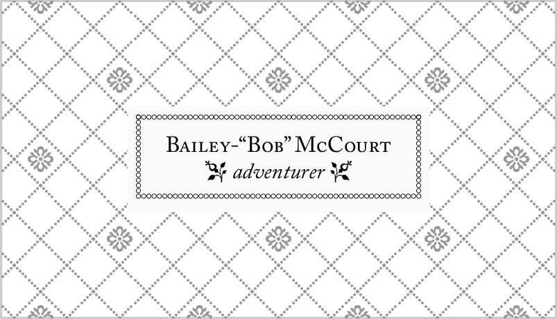

```latex
  \drawxgrid{%
    Nx=21,%
    Ny=12,%
    displaywidth=3.5in,
    displayheight=2in,
    color=black!40!white,
    yshift=0.5,
    flrmodval=4,
    xshift=1.0, 
    initial={\footnotesize \textsw{A}}
  }

  \filldraw[
    fill=black!2!white,
    draw=black,
    style=double,
    double distance=2pt,
    line width=0.8pt
  ]
  (0.15*\cardWidth,\cardHeight/2)
  -- (0.5*\cardWidth,0.9*\cardHeight)
  -- (0.85*\cardWidth,\cardHeight/2)
  -- (0.5*\cardWidth,0.1*\cardHeight)
  -- cycle;

  \node[draw=none, align=center, yshift=-3pt] at (\cardWidth/2, \cardHeight/2) (ctr) {
    \Telefon \;\; (123) 456-789 \\
    \Letter \;\; 5 Wallowing Dove Ln \\
    \faBriefcase \;\; \textit{Chief Good Times Officer} \\
    \Industry \;\; Ministry of Recreation \\
    \Football \;\; Thursdays @ 5pm \\
    \Lightning
  }; 

```


## Example Grids

### plain grid

```ruby
{ }
```

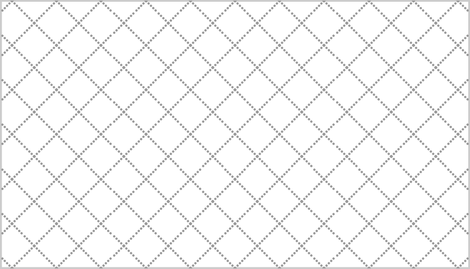

### alternate in decorated x's

```ruby
{ modval: 1 }
```

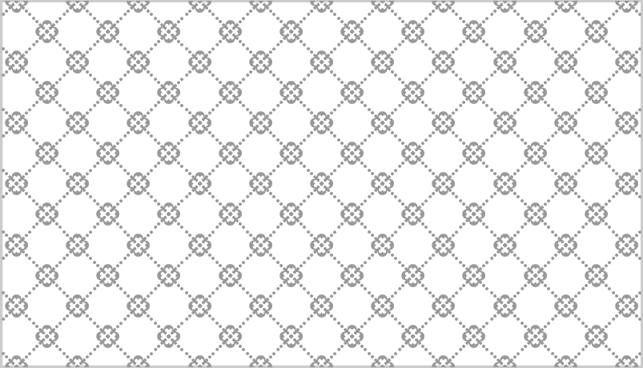

```ruby
{ modval: 2 }
```

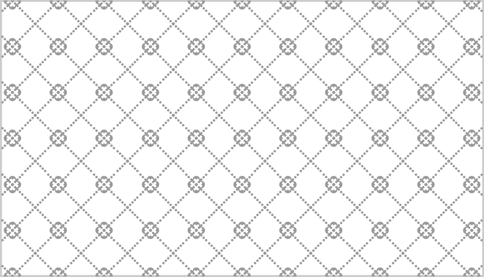

```ruby
{ modval: 3, xshift: 2.0 }
```

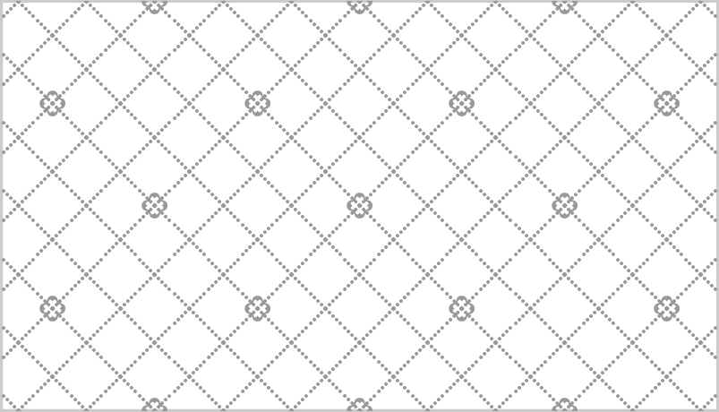

```ruby
{ modval: 4 }
```

### alternate in florins

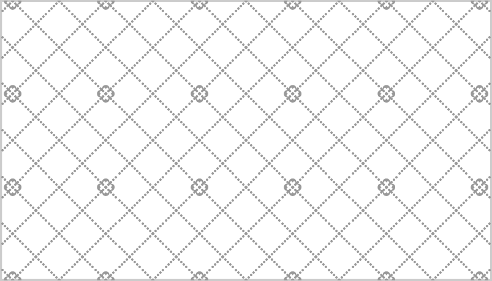

```ruby
{ flrmodval: 1, modval: 1 }
```

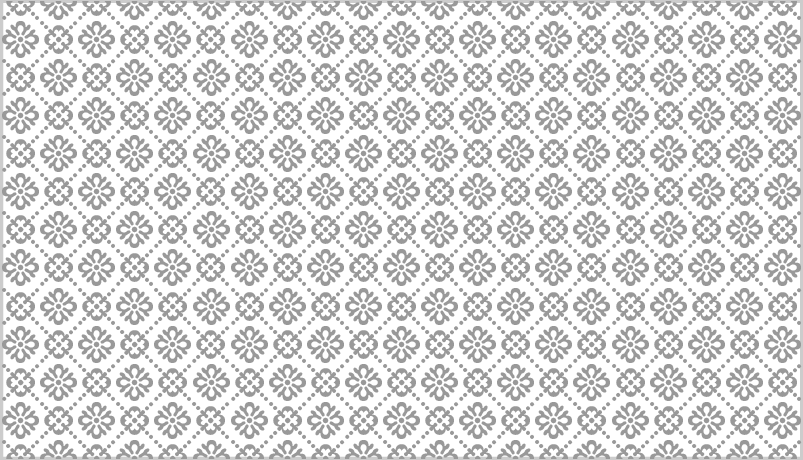

```ruby
{ flrmodval: 1 }
```

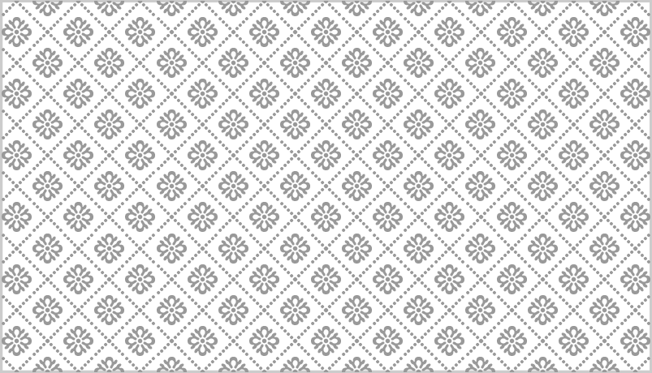

```ruby
{ flrmodval: 2, xshift: 1.0 }
```

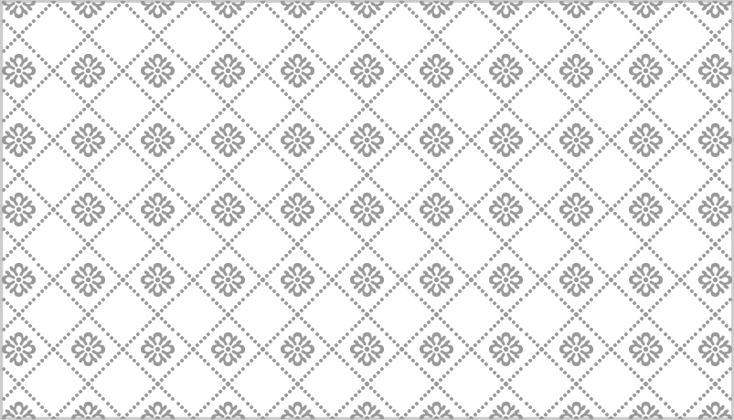

```ruby
{ flrmodval: 3, xshift: 3.0 }
```

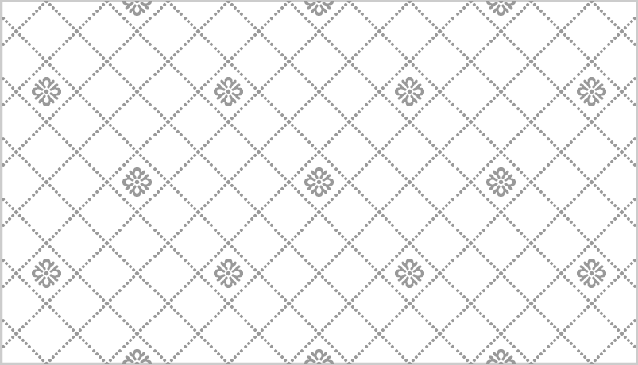

```ruby
{ flrmodval: 3, xshift: 6.0 }
```

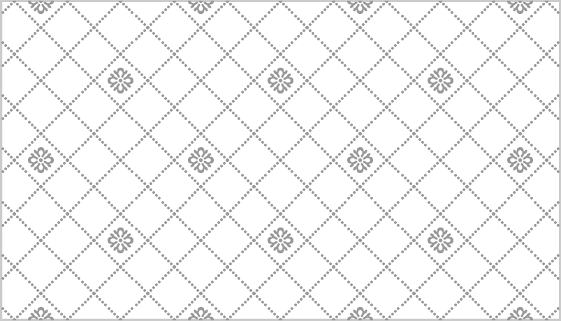

```ruby
{ flrmodval: 4, xshift: 1.0 }
```

### add initials

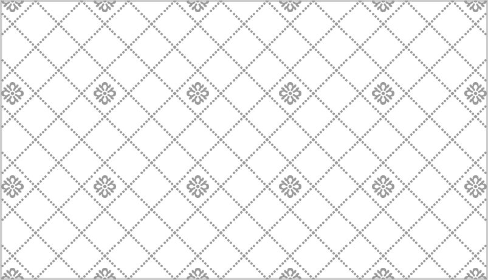

```ruby
{ flrmodval: 2, xshift: 1.0, initial: '{b}' }
```

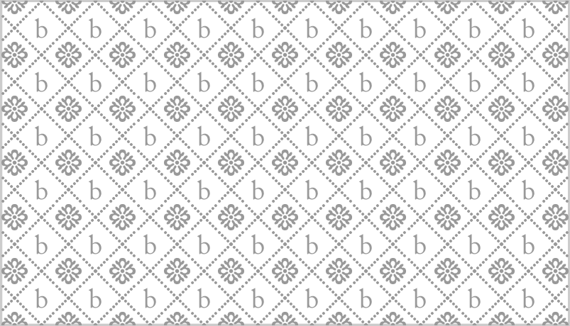

```ruby
{ flrmodval: 4, xshift: 1.0, initial: '{\\footnotesize \\textsw{A}}' }
```

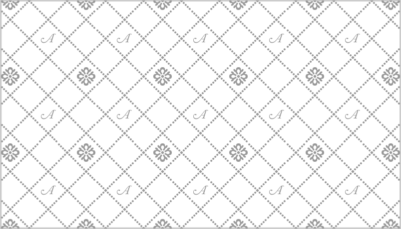


## Example Tiles

```ruby
  {
    tileA: "\\mdbia", colorA: "silver",
    tileB: "\\mdbb",  colorB: "paledogwood",
    tileC: "\\mdba",  colorC: "resedagreen",
    tileD: "\\mdba",  colorD: "cambridgeblue"
  }
```

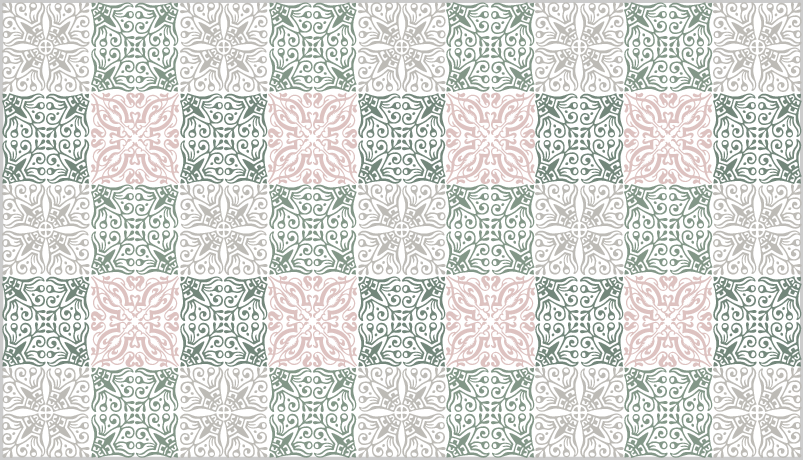

```ruby
  {
    tileA: "\\mdbie", colorA: "silver",
    tileB: "\\mdbie", colorB: "silver",
    tileC: "\\mdbe",  colorC: "black!30!silver",
    tileD: "\\mdbe",  colorD: "black!30!silver"
  }
```

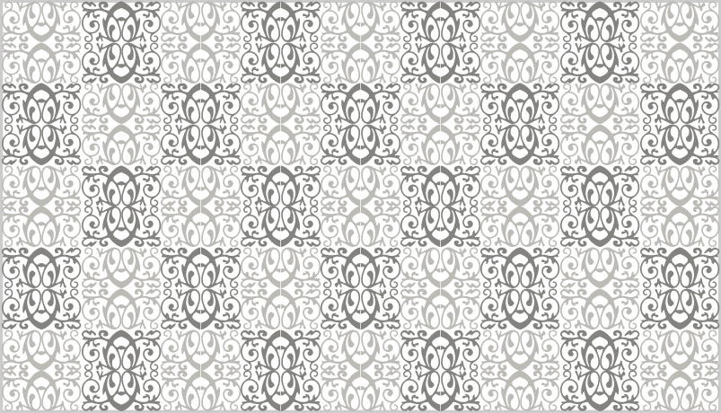

```ruby
  {
    tileA: "\\mdbb",  colorA: "silver",
    tileB: "\\mdbia", colorB: "silver",
    tileC: "\\mdbd",  colorC: "resedagreen",
    tileD: "\\mdbd",  colorD: "resedagreen"
  }
```

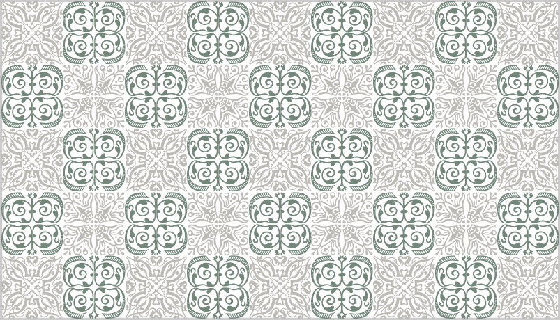

```ruby
  {
    tileA: "\\mdba",  colorA: "silver",
    tileB: "\\mdbia", colorB: "silver",
    tileC: "\\mdbb",  colorC: "silver",
    tileD: "\\mdbib", colorD: "silver"
  }
```

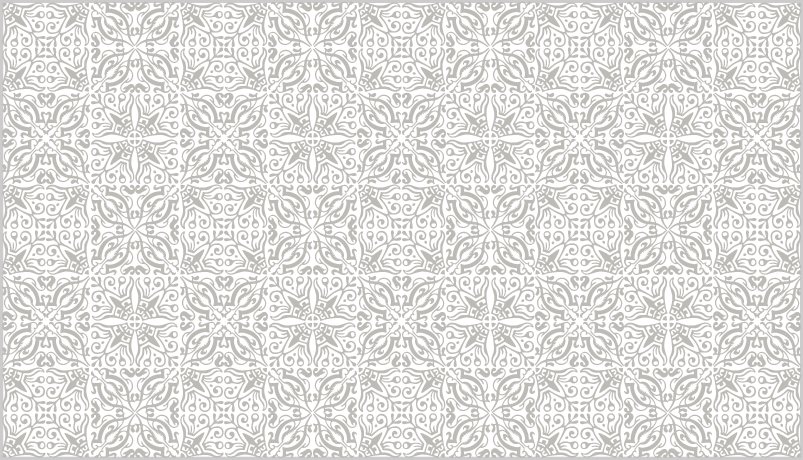

```ruby
  {
    tileA: "\\mdbhx", colorA: "silver",
    tileB: "\\mdbihx",colorB: "silver",
    tileC: "\\mdbb",  colorC: "silver",
    tileD: "\\mdbib", colorD: "silver"
  },
```

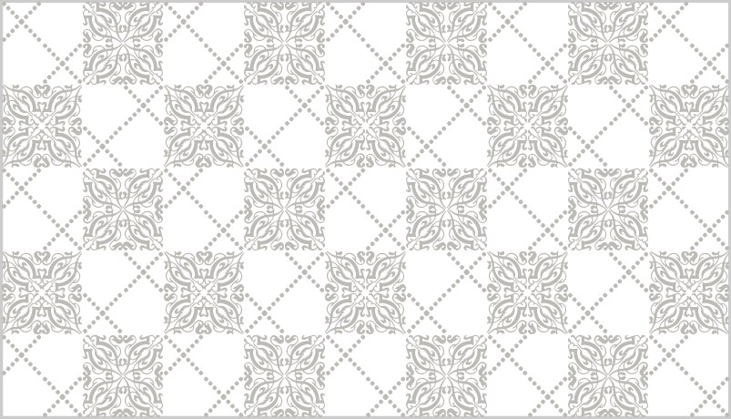

```ruby
  {
    tileA: "\\mdbc",  colorA: "silver",
    tileB: "\\mdbic", colorB: "silver",
    tileC: "\\mdbd",  colorC: "silver",
    tileD: "\\mdbid", colorD: "silver"
  }
```

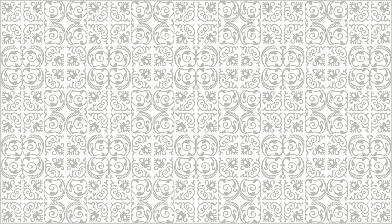
